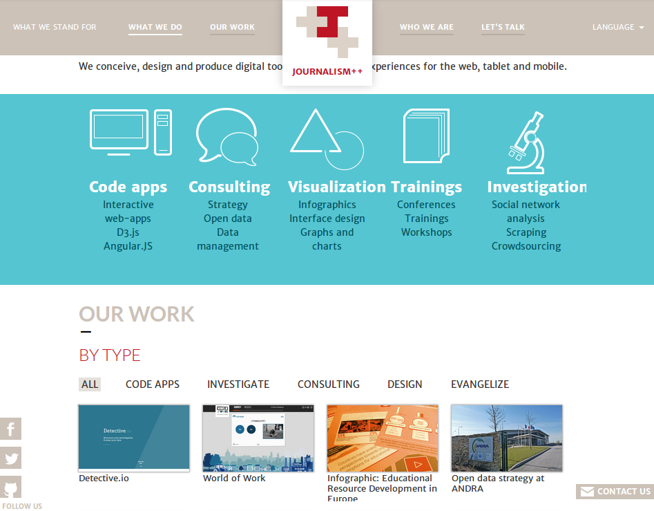

Journalism++ Web Site
=====================

_Copyright © 2014, Journalism++_


## Features

- CMS with [Django-CMS 3](https://www.django-cms.org/‎)
- I18n
- Mosaïc to present projects
- Trombinoscope
- Map
- Contact form




## Requirements

### System dependencies

	$ sudo apt-get install build-essential python-dev python-pip virtualenv sqlite3

### Node Dependencies (coffeescript & Less)
	
	$ npm install

## Installation

This script will

- install a virtualenv
- download all python dependencies inside
- initialize the database (with sqlite)  

```
$ make install
```

## Launch development server

	$ make run
